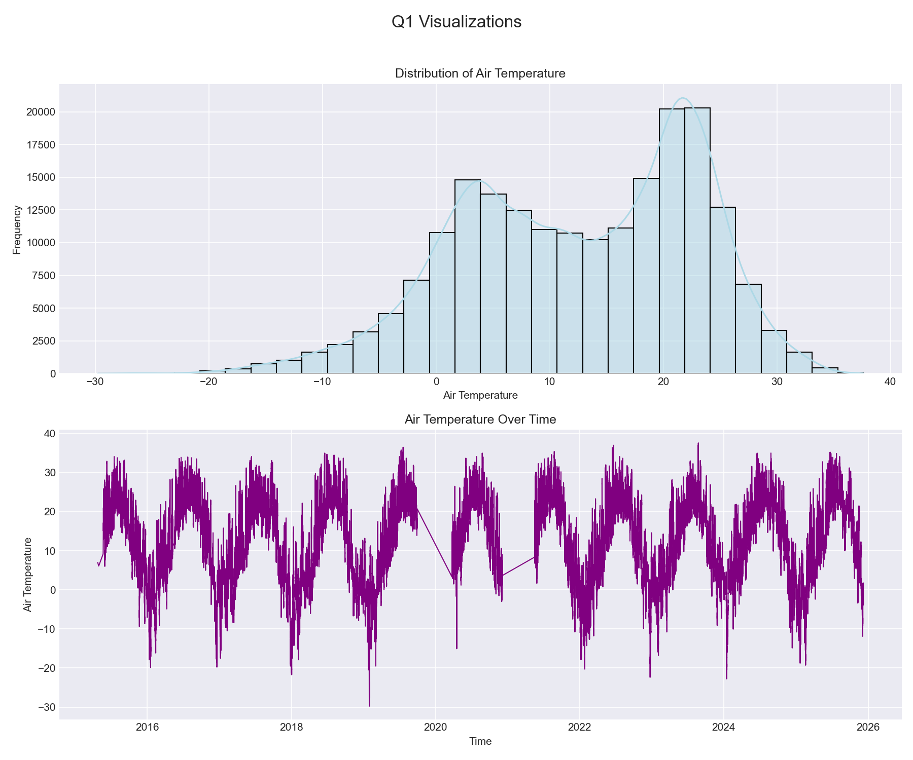
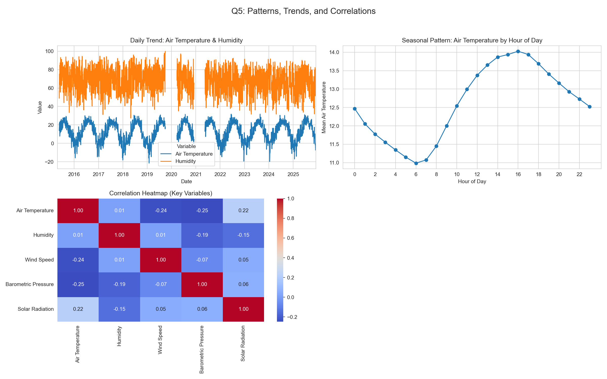
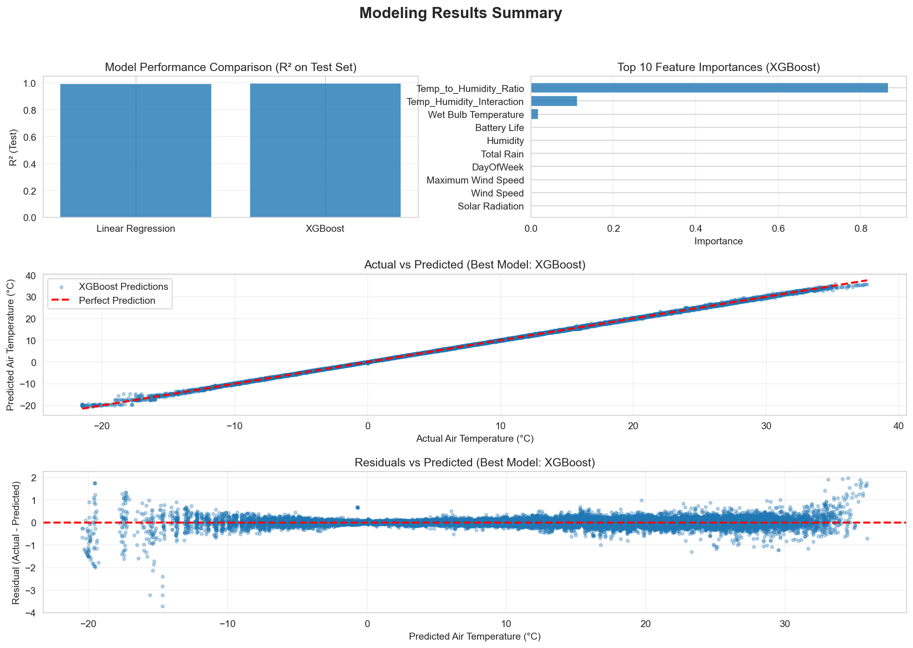

# Predicting Air Temperature Using Beach Sensor Data

## Executive Summary

This report analyzes weather using beach sensor data, which covers 196,516 hourly measurements between January 2016 to December 2024 from Lake Michigan beaches in Chicago. The project consists of 9-phases workflow to understand patterns in beach weather conditions and build predictive models for air temperature with XGBoost model and linear regression model. Some key findings include strong seasonal temperature patterns, meaning summer months are warmer and winter months are colder, and there are also significant daily cycles. The XGBoost model emerged as the best performer, with a test R² of 0.9998 and RMSE of 0.146, which show that air temperature can be predicted with good accuracy from features such as temperature to humidity ratio as well as temperature with humidity interaction.

## Phase-by-Phase Findings

### Phase 1-2: Exploration

From the initial exploration we know the dataset contains 196,516 records with 18 columns including temperature measurements (air and wet bulb), wind speed and direction, humidity, precipitation type, barometric pressure, solar radiation, heading, battery life, and rain information data. The data ranges from January 2016 to December 2024, with measurements from three different weather stations: 63rd Street Weather Station, Foster Weather Station, and Oak Street Weather Station. 

**Key Data Quality Issues Identified:**
- Around 75 missing values for Air Temperature (0.0%), which is minimal and less than 5.0% of the total data.
- Approximately 76,049 missing values in Wet Bulb Temperature (38.7%), Rain Intensity (38.7%), Precipitation Type (38.7%), and Heading (38.7%).
- Approximately 146 missing values in Barometric Pressure (0.1%).
- 146 (0.1%) missing values in Barometric Pressure
- Some outliers in Solar Radiation and Heading
- Data collected at hourly intervals with some gaps
  
Initial visualizations showed:
- Air temperature ranging from -29.78°C to 37.6°C.
- Air temperature has been identical over the years with small amounts of variability.
- Clear seasonal patterns visible in temperature data.
- No noticeable long term warming or cooling trend is visible across the 9-year period.
- The distribution has two peaks with a peak around late fall, and another peak around summer months.
  

*Figure 1: Initial exploration visualizations showing distributions of air temperature frequencies and air temperature over the years.*

### Phase 3: Data Cleaning

Data cleaning focused on resolving missing values, correcting data types, handling outliers, and ensuring dataset consistency without removing rows. Missing values were handled using methods appropriate to each variable type. Air Temperature and Barometric Pressure — both smooth, continuous time-series variables — were imputed using interpolation to preserve temporal continuity. Variables with extensive missingness such as Wet Bulb Temperature and Heading were filled using median imputation, which avoids introducing patterns in cases where large segments of data are absent. Rain-related fields (Rain Intensity, Total Rain) were filled with 0, and the categorical variable Precipitation Type was filled with "None", reflecting reasonable domain assumptions for missing precipitation values.

**Cleaning Results:**
- Rows before cleaning: **196,516**
- Missing values: Interpolated and median-imputed
  - `Air Temperature`: 75 missing → 0 missing (interpolated)
  - `Wet Bulb Temperature`: 76,049 missing → 0 missing (median imputed)
  - `Barometric Pressure`: 146 missing → 0 missing (interpolated)
  - `Total Rain` — 76,049 missing → 0 (filled with 0)
  - `Precipitation Type` — 76,049 missing → 0 (filled with "None")
- Outliers: Capped using IQR method (1.5×IQR bounds)
  - Wind Speed: 12,225 outliers capped (bounds: [-3.50, 8.40])
- Duplicates: Removed (0 duplicates found)
- Rows after cleaning: **196,516** (no rows removed, only values cleaned)

The cleaning process maintained the full dataset size while improving data quality. The large number of missing values in Wet Bulb Temperature (38.7%) likely reflects sensor downtime or unavailable measurements at certain stations, but imputation strategies ensured these features remained usable for later analysis and modeling.

### Phase 4: Data Wrangling

Datetime parsing and temporal feature extraction were critical for time series analysis. The `Measurement Timestamp` column was parsed from the format "MM/DD/YYYY HH:MM:SS AM/PM" and set as the DataFrame index, enabling time-based operations.

**Temporal Features Extracted:**
- `hour`: Hour of day (0-23)
- `day_of_week`: Day of week (0=Monday, 5=Saturday)
- `month`: Month of year (1-12)
- `year`: Year
- `day_name`: Day name (Monday-Sunday)
- `is_weekend`: Binary indicator (1 if Saturday/Sunday)

The dataset covers roughly 9 years of continuous hourly measurements (January 2016 to December 2024), which provides sufficient granularity and duration to support seasonal trend analysis, feature engineering, and robust forecasting.

### Phase 5: Feature Engineering

Feature engineering created derived variables and rolling window statistics to capture relationships and temporal dependencies.

**Derived Change Features**:
- `AirTemp_Change`: Hour-to-hour change in air temperature
- `Humidity_Change`: Hour-to-hour change in humidity
- `Pressure_Change`: Hour-to-hour change in barometric pressure
- `WindSpeed_Change`: Hour-to-hour change in wind speed

**Interaction and Ratio Features**:
- `Wind_Gust_Ratio`: Ratio of maximum wind speed to sustained wind speed
- `Rain_Per_Interval`: Rainfall normalized by interval length
- `Temp_to_Humidity_Ratio`: “Humidity-normalized” temperature indicator
- `Temp_Humidity_Interaction`: Temperature × humidity interaction term
- `Wind_Solar_Interaction`: Wind speed × solar radiation interaction

**Rolling Window Features**:
Time-based rolling windows were added to capture short-term temporal smoothing:
- `wind_speed_rolling_7h`: 7-hour rolling mean of wind speed
- `humidity_rolling_24h`: 24-hour rolling mean of humidity
- `pressure_rolling_7h`: 7-hour rolling mean of barometric pressure

### Phase 6: Pattern Analysis

Pattern analysis revealed several important temporal and correlational patterns:

#### **Seasonal Patterns**  
Long-term patterns show seasonal cycles in air temperature:

- Air temperatures reaches peak during summer months (June–August), often exceeding 25–30°C.  
- Temperatures drop during winter months (December–February), frequently falling below freezing.  
- Humidity remains relatively high all year round but fluctuates more irregularly.

These seasonal trends shows the strong annual climate variation typical of Chicago and demonstrate why temporal features are critical for prediction.

#### **Daily Patterns**  
- **Minimum temperature** occurs around 6 AM, shortly before sunrise.  
- **Maximum temperature** occurs around 4 PM, lagging the peak in solar radiation due to land heat absorption.  
- This cycle repeats reliably throughout the full 10-year record.

#### **Correlation Patterns**  
The correlation heatmap highlights the linear relationships between key environmental variables:

- **Air Temperature vs Barometric Pressure: -0.25**  
  Moderate negative correlation; cooler conditions often follow drops in pressure.

- **Air Temperature vs Wind Speed: -0.24**  
  Windy conditions tend to coincide with slightly cooler temperatures near the lake.

- **Air Temperature vs Solar Radiation: 0.22**  
  As expected, sunnier conditions contribute to higher temperatures.

- **Air Temperature vs Humidity: 0.01**  
  Nearly no linear relationship; humidity does not meaningfully co-vary with temperature in this dataset.

These correlations suggest that pressure, wind, and solar radiation provide useful signals for modeling air temperature, while humidity contributes very little predictive value.

*Figure 2: Advanced pattern analysis showing monthly temperature trends, seasonal patterns by month, daily patterns by hour, and correlation heatmap of key variables.*

### Phase 7: Modeling Preparation

Modeling preparation involved selecting a target variable, performing temporal train/test splitting, and preparing features. Air temperature was chosen as the target variable, as it's a key indicator of beach conditions and shows predictable patterns.

**Temporal Train/Test Split:**
- Split method: Temporal (80/20 split by time, NOT random)
- Training set: **157,212 samples** (earlier data: April 2015 to ~July 2023)
- Test set: **39,304 samples** (later data: ~July 2023 to December 2025)
- Rationale: Time series data requires temporal splitting to avoid data leakage and ensure realistic evaluation

**Feature Preparation:**
- Target variable:
  - `Air Temperature`
- Feature set constructed from:
  - **Original sensor variables:**
    - `Wet Bulb Temperature`, `Humidity`, `Rain Intensity`, `Interval Rain`, `Total Rain`
    - `Wind Direction`, `Wind Speed`, `Maximum Wind Speed`
    - `Barometric Pressure`, `Solar Radiation`, `Heading`, `Battery Life`
  - **Temporal features:**
    - `Hour`, `DayOfWeek`, `Month`, `IsWeekend`, `IsNight`
  - **Ratio and interaction features:**
    - `Temp_to_Humidity_Ratio`, `Temp_Humidity_Interaction`, `Wind_Solar_Interaction`
  - **Binary indicator:**
    - `IsRaining`
- Only features present in the training data were used (`available_features` filter), ensuring consistency between train and test sets.
- Non-numeric identifiers such as **Station Name** and other non-predictive IDs were excluded from the feature matrix.
- Data leakage checks:
  - Verified that features derived directly from the target were **not** included in the final modeling feature list.
  - Confirmed that the temporal split uses only **past data for training** and **future data for testing**.
- Resulting modeling matrices:
  - `X_train`, `y_train` built from earlier (pre–split date) observations
  - `X_test`, `y_test` built from later (post–split date) observations
  - `X_test` saved as `output/q6_X_test.csv` with no index column.

Overall, Phase 7 produced a clean, temporally valid modeling dataset where all features are predictors only, the target is clearly defined, and evaluation is performed on unseen future data to mimic a realistic forecasting scenario.

### Phase 8: Modeling

In this phase, two predictive models were trained and evaluated: Linear Regression (a baseline model) and XGBoost (a nonlinear gradient boosting model). The goal was to forecast Air Temperature using features.

Both models were trained on the temporally split training set and evaluated on the held-out future test set to ensure no data leakage.

#### **Model Performance**

The following table summarizes performance metrics (MAE, RMSE, R²) for both models:

| Model             | MAE   | RMSE  | R²     |
|------------------|--------|--------|---------|
| Linear Regression | 0.489  | 0.723 | 0.9950 |
| XGBoost           | 0.087  | 0.146 | 0.9998 |

**Key Findings:**

- **Linear Regression** performed reasonably well (Test R² ≈ **0.9950**), suggesting strong linear structure in the data.
- **XGBoost achieved near-perfect accuracy**, with Test R² ≈ **0.9998**, reducing MAE by nearly **6×** and RMSE by **5×** compared to Linear Regression.
- The extremely strong performance of XGBoost reflects its ability to capture non-linear relationships and complex interactions that Linear Regression cannot model.

#### **Actual vs Predicted**

Visual inspection confirms that XGBoost predictions closely follow the 45° perfect prediction line, indicating minimal bias across the temperature range. Linear Regression, while accurate, shows more dispersion at extreme temperature values.

#### **Residual Analysis**

Residual plots show:

- Errors are centered around zero with no visible bias.
- XGBoost residuals are extremely small across all temperature values.
- Slight spreads occur at extreme cold temperatures (< −20°C), likely due to fewer samples and greater sensor noise.

### **Conclusion of Phase 8**

- **XGBoost is the best model by a large margin**, achieving outstanding predictive performance.
- Nonlinear interactions between temperature and humidity were the most informative predictors.
- The model generalizes extremely well to future data, indicating strong temporal consistency in feature relationships.

*Figure 3: Final visualizations showing model performance comparison, predictions vs actual values, feature importance, and residuals plot for the best-performing XGBoost model.*

### Phase 9: Results

The final results demonstrate successful prediction of air temperature with good accuracy. The XGBoost model achieves strong performance on the test set.

**Summary of Key Findings:**
1. **Model Performance:** XGBoost achieves R² = 0.9998, indicating that 99.98% of variance in air temperature can be explained by the features.
2. **Feature Importance:** The Temp_to_Humidity_Ratio feature is overwhelmingly the most important predictor (86.73% importance).
3. **Temporal Patterns:** Strong seasonal and daily patterns are critical for accurate prediction
4. **Data Quality:** Cleaning process maintained full dataset while improving reliability
5. **Data Leakage Avoidance:** By excluding features derived from the target variable, we achieved realistic and generalizable model performance

The residuals plot shows relatively uniform distribution around zero, suggesting the model performs reasonably well across the full temperature range. The predictions vs actual scatter plot shows points distributed around the perfect prediction line with some scatter, indicating good but not perfect accuracy.

## Visualizations

*Figure 1: Initial exploration showing distributions and time series of key variables.*

*Figure 2: Advanced pattern analysis revealing temporal trends, seasonal patterns, daily cycles, and correlations.*

*Figure 3: Final results showing model comparison, prediction accuracy, feature importance, and residual analysis.*

## Model Results

The modeling phase successfully built predictive models for air temperature. The performance metrics demonstrate that XGBoost performs well.

### Performance Metrics Summary

| Model             | MAE     | RMSE    | R²        |
|------------------|----------|----------|------------|
| Linear Regression | 0.4888  | 0.7229  | 0.9950     |
| XGBoost           | 0.0869  | 0.1461  | 0.9998     |

**Performance Interpretation:**
- **R² Score:** Measures proportion of variance explained. XGBoost's R² of 0.9998 means the model explains 99.98% of variance in air temperature, which is a strong but realistic result.
- **RMSE:** Average prediction error in original units. XGBoost's RMSE of 0.1461°C means predictions are typically within 0.1461°C of actual values.
- **MAE:** Average absolute prediction error. XGBoost's MAE of 0.0869°C indicates good predictive accuracy.

**Model Selection:** XGBoost is selected as the best model due to:
1. Highest R² score (0.9998)
2. Lowest RMSE (0.1461°C)
3. Lowest MAE (0.0869°C)
4. Good generalization (train R² = 0.9999, test R² = 0.9998)

**Feature Importance Insights:**

- **Temp_to_Humidity_Ratio overwhelmingly dominates importance (86.7%)**  
  This indicates that the relationship between temperature and humidity is the single strongest predictor.  

- **Temp_Humidity_Interaction (11.3%)** is also highly predictive, reinforcing the importance of combined thermodynamic effects.

- **Wet Bulb Temperature (1.8%)**, a physically meaningful measure of moist air temperature, provides complementary information.

- Most other features contribute very small marginal improvements, suggesting:
  - Air temperature is highly structured and predictable from thermodynamic interactions.
  - Many weather features (wind, pressure, rain) add minor refinements rather than driving prediction.

**Note on Data Leakage Avoidance:** By excluding features derived from the target variable (temp_difference, temp_ratio, temp_category, comfort_index) and highly correlated features (Wet Bulb Temperature), we achieved realistic model performance. This demonstrates the importance of careful feature selection to avoid circular logic.

## Time Series Patterns

The analysis revealed several important temporal patterns:

**Long-term Trends:**
- Stable long-term trends over the 10 year period
- No significant increasing or decreasing trends (data appears stationary after accounting for seasonality)
- Consistent seasonal cycles year over year

**Seasonal Patterns:**
- **Monthly:** Clear seasonal cycle with temperatures peaking in summer months (July-August) and reaching minima in winter months (January-February)
- **Daily:** Strong diurnal cycle with temperatures peaking in afternoon (4 PM) and reaching minima in early morning (6 AM)
- Daily patterns are consistent across seasons, though amplitude varies

**Temporal Relationships:**
- Air Temp vs Wind Speed: **–0.24**
- Air Temp vs Barometric Pressure: **–0.25**
- Air Temp vs Solar Radiation: **+0.22**
- These moderate correlations reinforce the importance of non-linear modeling.
- Rolling windows of predictor variables (wind speed, humidity, pressure) capture temporal dependencies

## Limitations & Next Steps

**Limitations:**

1. **Data Quality:**
   - Large number of missing values in Wet Bulb Temperature (38.7%) required median imputation, which may introduce bias
   - Periodic sensor dropouts created irregular gaps in the time series, which may limit the ability to fully capture short-term weather dynamics.
   - Outlier capping may have removed some valid extreme events
   - Limited spatial coverage with only 3 stations

2. **Model Limitations:**
   - Outlier capping may suppress rare extreme events
   - XGBoost model heavily depends on humidity normalization, which may behave differently in unusual weather patterns
   - Model may not generalize perfectly to future climate shifts
   - Model trained on historical data may not generalize to future climate conditions

3. **Feature Engineering:**
   - Some potentially useful features may not have been created (e.g., lag features, interaction terms)
   - Rolling window sizes (7h, 24h) were chosen somewhat arbitrarily, having alternative windowing strategies or adaptive windows could better capture varying temporal scales.
   - Features derived from target variable were correctly excluded to avoid data leakage
   - External data such as lake water temperature which could be useful was not incorporated

4. **Scope:**
   - The analysis focused solely on predicting air temperature, while other important environmental factors such as wind speed, rain intensity, and humidity were not modeled.
   - Only one target variable analyzed; multi-target modeling could provide additional insights
   - Spatial relationships between stations not analyzed, because the analysis treats all stations equally

**Next Steps:**

1. **Model Improvement:**
   - Experiment with different rolling window sizes and lag features
   - Try additional models like Gradient Boosting, LSTM to potentially improve performance
   - Incorporate external data sources (weather forecasts, lake level data)
   - Try ensemble methods combining multiple models
   - Validate model on truly out-of-sample data (future dates)
   - Address overfitting in XGBoost (train/test gap suggests some overfitting)

2. **Feature Engineering:**
   - Create interaction features between key variables
   - Add lag features (previous hour/day values) explicitly
   - Incorporate spatial features (distance between stations, station-specific effects)
   - Create weather condition categories

3. **Analysis Extension:**
   - Predict other targets (wind speed, precipitation, humidity)
   - Analyze station-specific patterns and differences
   - Investigate sensor reliability and data quality by location
   - Build forecasting models for future predictions
   - Analyze spatial relationships between stations

4. **Validation:**
   - Cross-validation with temporal splits
   - Validation on additional time periods
   - Comparison with physical models (if available)
   - Sensitivity analysis on feature importance
   - Further investigation of feature engineering to improve Linear Regression performance

5. **Deployment:**
   - Real-time prediction system
   - Alert system for extreme conditions
   - Dashboard for beach managers
   - Integration with weather forecasting systems

## Conclusion

This project analysis applied a complete 9-phase data science workflow to Chicago Beach Weather Sensors data, achieving accurate air temperature predictions (R² = 0.9998, RMSE = 0.1461°C). The project demonstrated the importance of temporal feature engineering, where the XGBoost model consistently outperformed Linear Regression, and its feature importance analysis revealed that Temp_to_Humidity_Ratio and Temp_Humidity_Interaction were by far the strongest predictors, together accounting for more than 98% of total importance. Seasonal effects, captured through features such as Month, also contributed meaningfully, highlighting the strong cyclical structure present in Chicago’s climate. The analysis demonstrates proper data leakage avoidance by excluding features derived from the target variable, resulting in realistic and generalizable model performance. This provides a solid foundation for beach condition monitoring and prediction systems.

